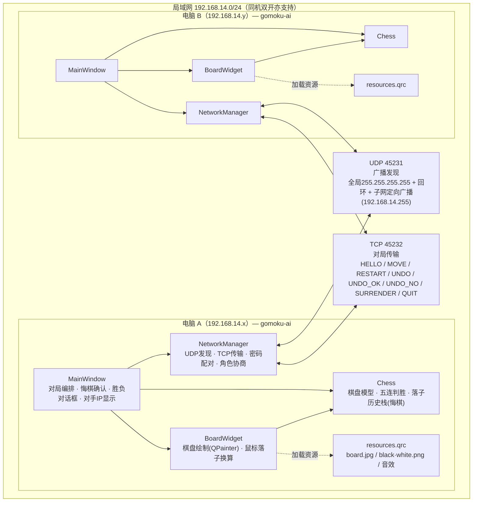
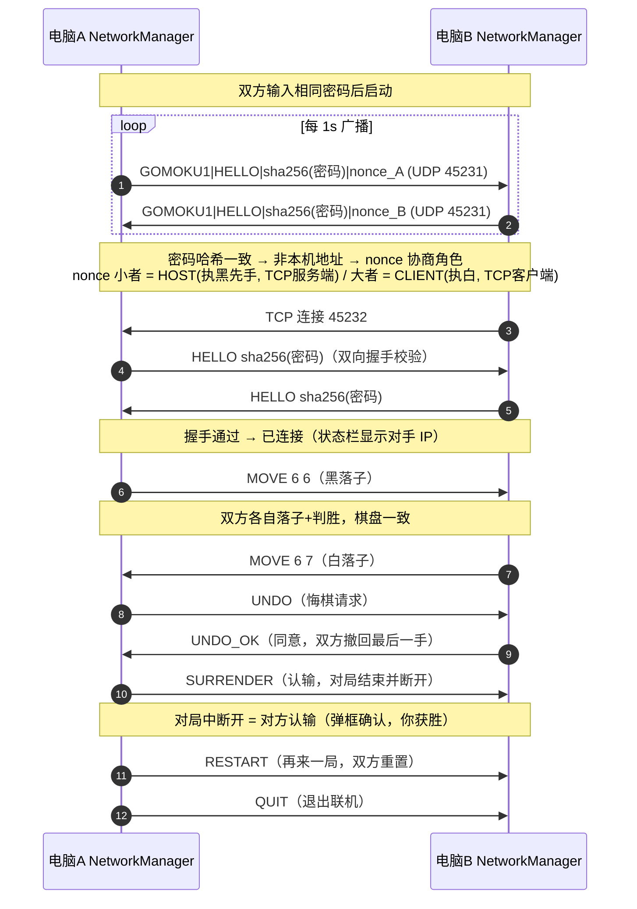

# 五子棋局域网对战 — 系统架构图

## 1. 总体架构

## 2. 配对与对局时序

## 3. 关键机制

| 机制 | 说明 |
|---|---|
| 密码配对 | 密码 SHA-256 哈希做广播过滤 + TCP 双向握手校验，哈希不符即断开 |
| 角色协商 | 双方用同一组 (nonce_A, nonce_B) 独立计算，nonce 小者执黑，结果必然一致 |
| 同机双开 | UDP `ShareAddress` 共享绑定 + TCP 绑定竞争（先绑定者执黑），不依赖 UDP 回环投递 |
| 跨设备发现 | 三路广播：全局 255.255.255.255 + 本机回环 + 每个活动网卡的子网定向广播（如 192.168.14.255） |
| 悔棋 | 请求-确认制：UNDO → 对方弹窗 → UNDO_OK 双方撤回最后一手（Chess 落子历史栈） |
| 认输/断开 | SURRENDER 协议；对局中断开视为对方认输（弹框确认获胜）；本地断开需确认 |
| 配对倒计时 | 搜索/连接阶段状态栏每秒显示剩余秒数（30s 搜索 / 10s 配对） |
| 换肤 | 菜单 4 款内置棋盘（米白/翡翠绿/浅橙/木质，600×600 19 路）+ 本地图片（QSettings 持久化），背景任意尺寸等比铺满 |
| 棋盘规格 | 19×19；上边距 68、左边距 72、格距 25.3（按底图实测，棋子 <1px 对齐格点） |
| 等比缩放 | 窗口缩放时棋盘 QPainter scale 变换等比跟随（逻辑 600×600，鼠标坐标反算） |
| 容错 | 配对超时/失败后恢复「联机对战」按钮可重试；对端退出/掉线自动清理 |
